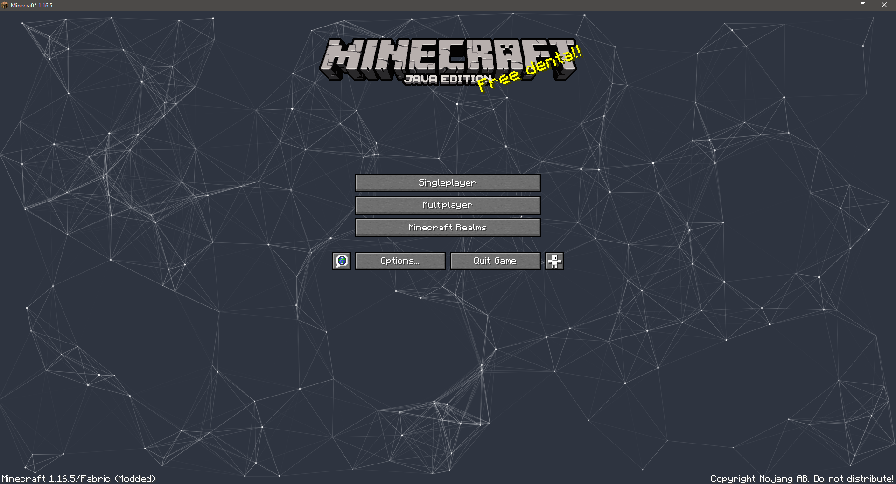

# Particle Title Menu

## Details
Overrides the default Minecraft Title Menu with moving particles that can interact with each other and the mouse.  Comes with a config which allows fine-tuned control over particle behavior as well as their look and feel.  If things don't work right, please open an issue, so I can look into it.

## Screenshots

## Download
You can download from the [releases](https://github.com/MorningSage/ParticleTitleMenu-Fabric/releases) here on Github or directly from [CurseForge](https://www.curseforge.com/minecraft/mc-mods/particle-title-menu):

## License
This code is under the CC0 license. Feel free to learn from it and incorporate it in your own projects.